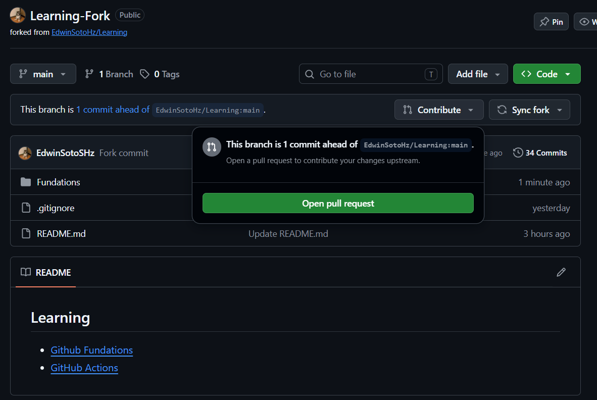
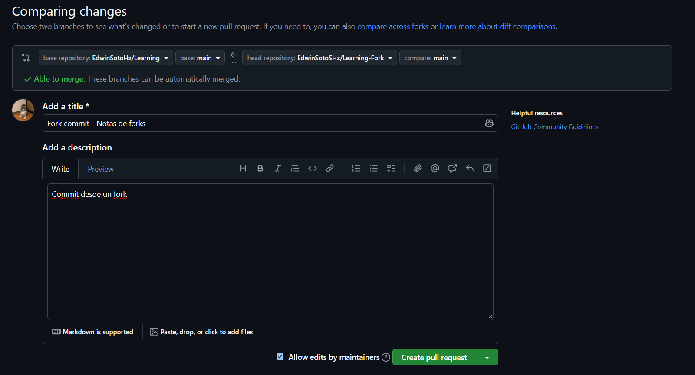
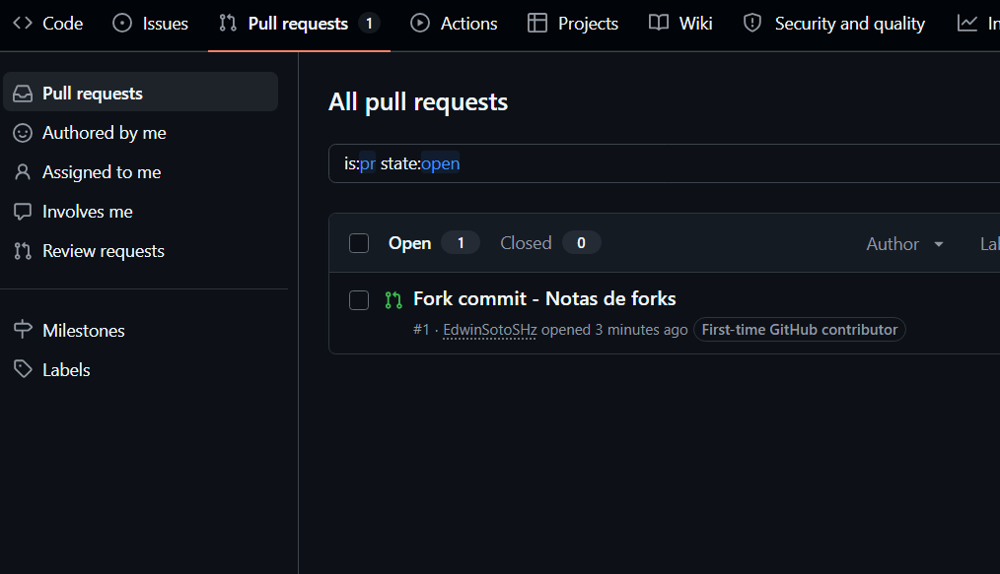
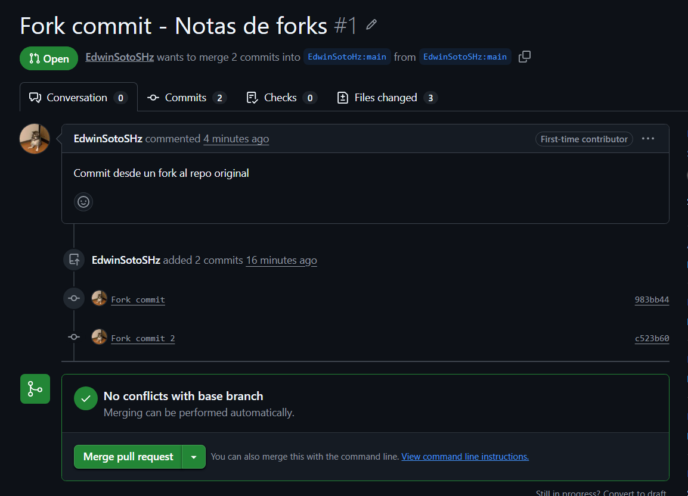
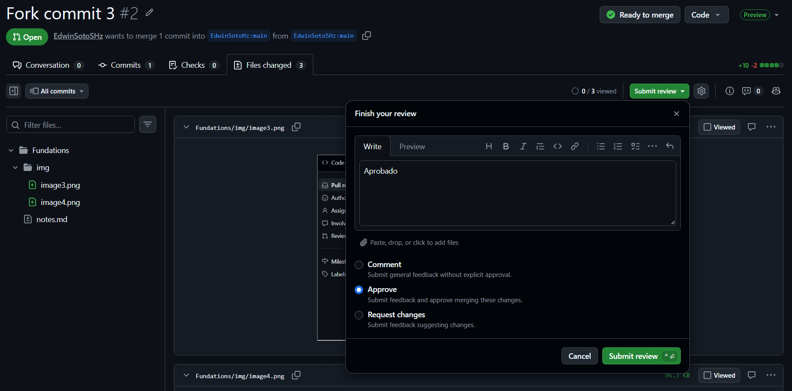

## BASH

```bash
ls              ## listar
ls -la          # listar con detalles y ocultos
pwd             # ruta actual

mkdir Folder    # crear carpeta
touch File.txt  # crear archivo

code / agy file # abrir en VSCode
clear           # limpiar terminal
```
<br>
<br>

## Git: Control de versiones distribuido

**Version y help**
```bash
git -v
git -h
```
<br>

**Config global**
```bash
git config --global user.email ""
git config --global user.name ""
```
<br>

**Config repo**
```bash
git config user.name ""
git config user.email ""
```
<br>

**Conceptos:**
- **HEAD** → dónde está situado el proyecto actualmente.
- **Snapshot** → "foto" del repo (commit pusheado).
- **Flujo:** Área local → Área Stage → Commit → Foto (local o GitHub).
- En la rama `main` hay fotos acumuladas (estados del repo).
- **HEAD** no es lo mismo que el final de la rama, aunque por lo regular debería ser lo mismo
<br>

**Iniciar en local:**
```bash
git init                    # crea repo local (.git)
git branch -m master main   # cambia el nombre de la rama master a main (solo si se necesita)
```
<br>

**Hacer commits:**
```bash
git status                  # rama, files para el siguiente commit (en stage), archivos no en stage y no trackeados
git add <file> <file> <file>      # agregar snapshots al área stage
git commit -m ""            # guarda snapshot del área stage con mensaje
git push                    # envía foto al álbum (solo si existe un repo en github)
```
<br>

**Ver historial:**
```bash
git log                     # hash y datos de commits
git log --graph             # historial gráfico
git diff                    # líneas cambiadas vs último commit
```
<br>

**.gitignore**
```
**/file.txt
/Folder/
file.txt
```
<br>

**Alias**
```bash
git config --global alias.aliasname "commnand"
git config --global alias.tree "log --graph --decorate --all --oneline"
```
<br>

**Deshacer**
```bash
git reset    # vacía git add (archivos intactos)
```
<br>

**Navegar / recuperar**
```bash
git checkout <file/hash/rama>   # cambiar rama, ver commit o regresar un file
```
<br>

**Ver estados del repo**
HEAD = ES DONDE ESTA EL "VISOR"
MAIN/nombre de la rama = ES DONDE ACABA LA RAMA
```bash
git checkout <hash>         # Solo mueve el visor HEAD
git checkout <branch>       # Mueve el visor HEAD al ultimo commit de la rama  
```
<br>

**Regesar oficialemente a un commit**
```bash
git reset --hard <hash>    # borra commits hasta el hash indicado y regresa los archivos a ese punto (ahora ese es el final de la rama, checkout no lo regresa, solo regresa el visor HEAD, pero no recontruye la rama, requiere usar otro hard reset)
git reflog                 # muestra el log de todo lo realizado
```
<br>

**Tags: para desplazarse o solo para marcar commits**
```bash
git tag <tag>        # Agrega un tag al commit actual
git checkout <tag>   # Se mueve al tag indicado
git tag              # Muestra todos los tags
git tag -d <tag>     # Elimina un tag 
```
<br>

**Ramas**
```bash
git branch <name>        # Crear una rama
git checkout <switch>    # Pasar a esa rama
git merge <branch>       # Traer los cambios de la rama indicada <> a la rama actual (buuena practica es que las ramas agregadas primero hagan merge de lo que hay en main y depues main haga merge)
git diff <brach>         # Diferencia entre la rama actual y la rama indicada
git branch -d <branch>   # Borrar una rama (solo si ya no se va a usar o si ya acabó su trabajo)
```
- *Un merge normalemnte hace un add y commit, pero su tarea es traer cambios y hacer el commit*
- *En caso de conflicto, no se hace ni add ni commit en la rama, solo trae los cambios*
- *Por lo que hay que borrar el codigo malo y dejar solo lo correcto y despues hacer el add y commit*
- *Resolver conflictos es traer cambios, hacer add y hacer commit*
- ***Merge es para traer cambios (actualizar mi rama) y en main es para actualizar el main***
- ***Las ramas se crear para trabajar algo aparte y cuando acaban se deben eliminar (aunque parezcan desaparecer, lo que pasa es que todo lo que hace la rama se integra al main)***
- ***Flujo Normal: Descargar repo, crear rama, hacer lo que se tenga que hacer, merge, eliminar rama, subir cambios con push***
<br>

**Stash**
```bash
git stash        # Guarda el trabajo que está added ni commited en un stash 
git stash list   # Ver el stash 
git stash pop    # Obtener el stash
git drop stash   # Borrar el stash
```
<br>
<br>

## GitHub: Espejo de lo que hay en el repo local

**Vincula tu repositorio local con GitHub**
```bash
git remote add origin <ssh/https>
git push -u origin main

# Si hay conflicto, se puede permitir historias no relacionadas o forzar el push o hacer antes rebas
git push -u origin main --allow-unrelated-histories
git push -u origin main --force

# PARA CUANDO NO SE ESTÁ ACTUALIZADO Y NO SE PUEDE HACER PUSH
git fetch # Trae el historial de cambios
git pull  # Trae los cambios

git config pull.rebase false  # Forma de hacer merge y pull
git push -u origin main

git clone <ssh> # Clona el repositorio
```

**Fork: Para colaborar en repos opensource o publicos de desconocidos**
- Es una copia de un repo pero un repo propio
- Se puede hacer que cambios en el fork se envien al repo original:
    1\. Crear fork y clonarlo
    2\. Sincronizar 
    3\. Hacer pull request (PR)
    4\. El dueño decide si aceptarlo o no
    5\. El tambien puede enviar su aprovacion con comentario, pero debe hacer un merge para integrar los cambios (otro commit)
    <table>
        <tr>
            <td align="center">
            
            </td>
            <td align="center">
                
            </td>
        </tr>
        <tr>
            <td align="center">
                
            </td>
            <td align="center">
                
            </td>
        </tr>
        <tr>
            <td colspan="2" align="center">
                
            </td>
        </tr>
    </table>

**Colaborador: Normalmente repos privados o internos del mismo equipo**
- Otra forma más directa de colaborar
- Es diferente al fork pero depende del caso
    1\. Clonar el orignal
    2\. Hacer rama
    3\. Trabajar
    4\. Hacer push a la rama `git push origin <branch>`
